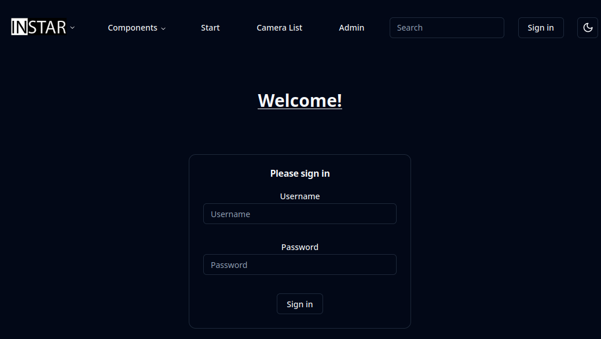
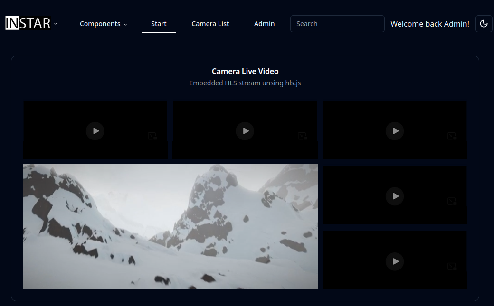
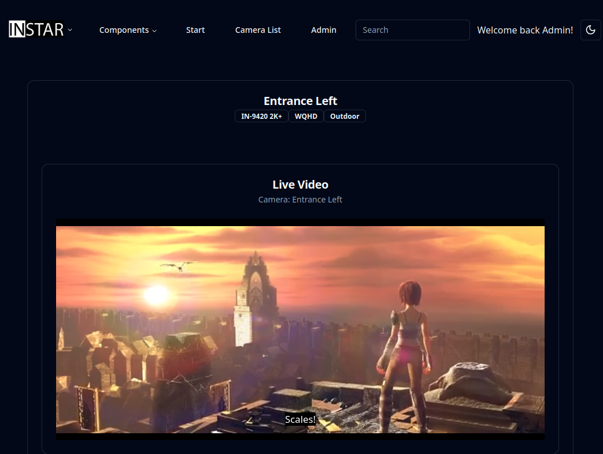
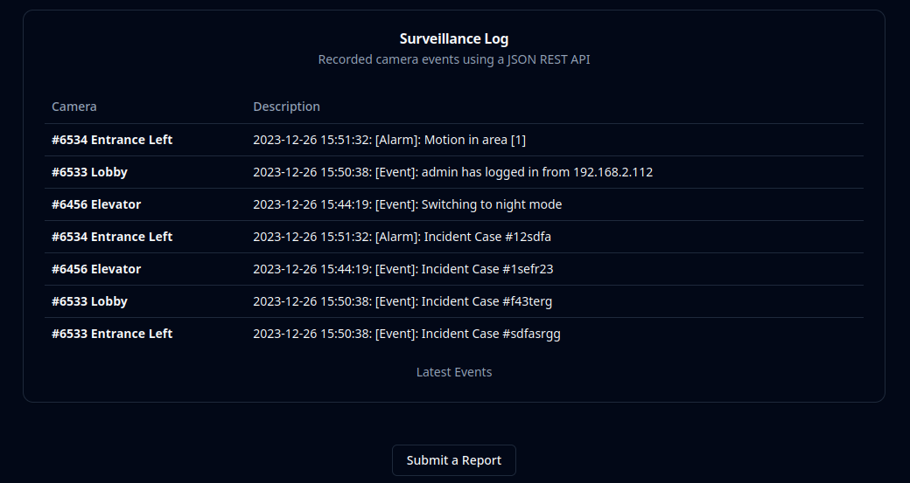
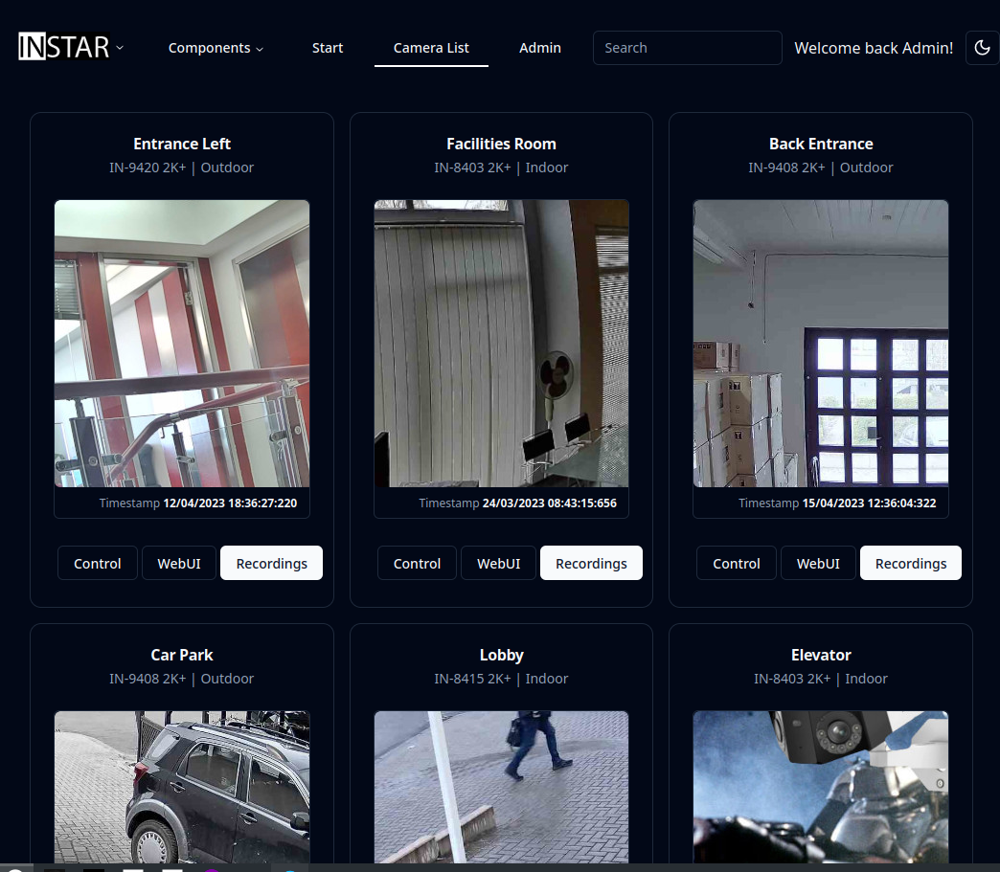
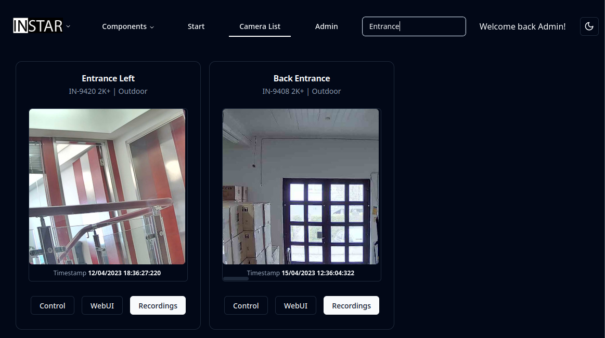
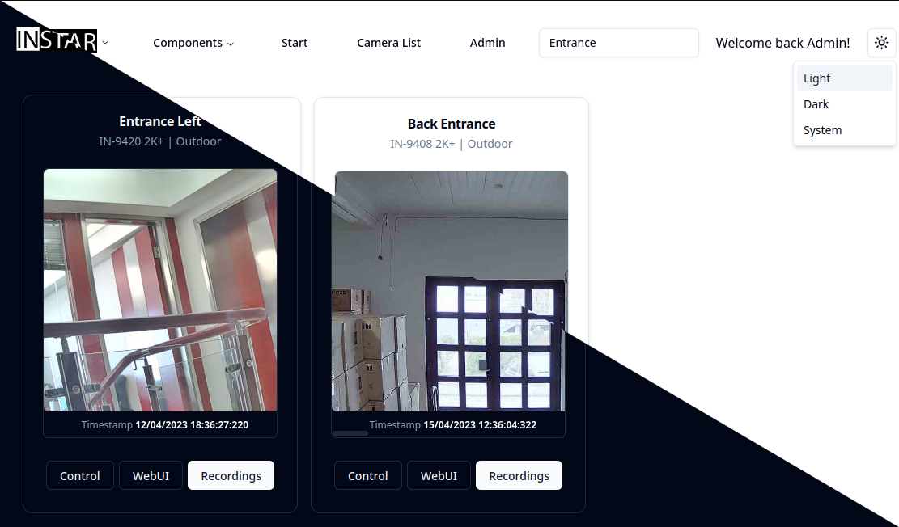
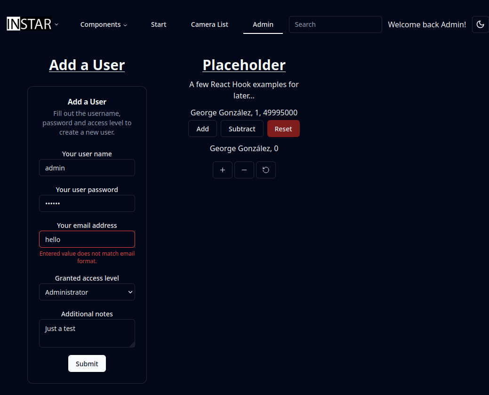
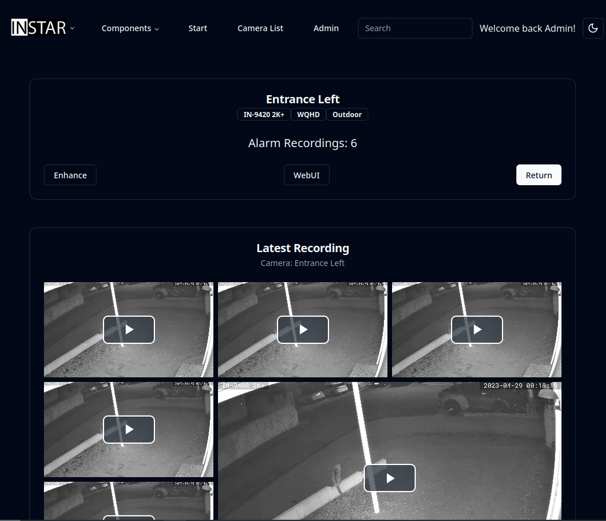

# React Typescript UI

<!-- TOC -->

- [React Typescript UI](#react-typescript-ui)
  - [Vite.js](#vitejs)
    - [Routing and State Management](#routing-and-state-management)
    - [Frontend Components and Styling](#frontend-components-and-styling)
  - [Features](#features)
    - [Mocked Backend Login](#mocked-backend-login)
    - [HLS Live Streaming](#hls-live-streaming)
    - [JSON Rest APIs](#json-rest-apis)
    - [Dark/Light Theme](#darklight-theme)
    - [Form Validation](#form-validation)
    - [Displaying Video Files](#displaying-video-files)

<!-- /TOC -->


## Vite.js

Scaffold your React Typescript app with [Vite.js](https://vitejs.dev/):

```bash
npm create vite@latest react-ts --template react-swc-ts
```

> Alternatives: Vanilla javascript and Typescript SSR:

```bash
npm create vite@latest react-js --template react-swc

npm create vite@latest react-ts-ssr
✔ Select a template: › ssr-react
✔ Select a variant: › TypeScript + SWC
```


### Routing and State Management

[React-Router](https://reactrouter.com/en/main) and [React-Redux](https://react-redux.js.org/):

```bash
npm install react-router-dom @reduxjs/toolkit react-hook-form react-redux
```


### Frontend Components and Styling

[ShadCN UI](https://ui.shadcn.com/) and [Tailwind CSS](https://tailwindcss.com/)

```bash
npm install -D tailwindcss postcss autoprefixer
```

_tsconfig.json_

```json
{
  "compilerOptions": {
    // ...
    "baseUrl": ".",
    "paths": {
      "@/*": [
        "./src/*"
      ]
    }
    // ...
  }
}

```

```bash
npm i -D @types/node
```

_vite.config.ts_


```ts
import path from "path"
import react from "@vitejs/plugin-react"
import { defineConfig } from "vite"

export default defineConfig({
  plugins: [react()],
  resolve: {
    alias: {
      "@": path.resolve(__dirname, "./src"),
    },
  },
})
```


```bash
npx shadcn-ui@latest init

✔ Would you like to use TypeScript (recommended)? … yes
✔ Which style would you like to use? › New York
✔ Which color would you like to use as base color? › Zinc
✔ Where is your global CSS file? … src/styles/global.css
✔ Would you like to use CSS variables for colors? … yes
✔ Are you using a custom tailwind prefix eg. tw-? (Leave blank if not) …
✔ Where is your tailwind.config.js located? … tailwind.config.js
✔ Configure the import alias for components: … @/components
✔ Configure the import alias for utils: … @/lib/utils
✔ Are you using React Server Components? … no
✔ Write configuration to components.json. Proceed? … yes
```

```bash
npx shadcn-ui@latest add <component name>
```

```ts
import { Component } from "@/components/ui/<component name>"
```


## Features

### Mocked Backend Login

Login using Redux state to block access to components based on auth level:





### HLS Live Streaming

Using `hls.js` to access `*.m3u8` video streams:








### JSON Rest APIs

Retrieving and displaying structured data from HTTP APIs:








Implement a search function by filtering the JSON data:





### Dark/Light Theme

Using `shadcn-ui` to implement a day/night theme toggle:





### Form Validation

Using `react-hook-form` for form validation:





### Displaying Video Files

Play MP4 h.264 video files using `video.js`:


